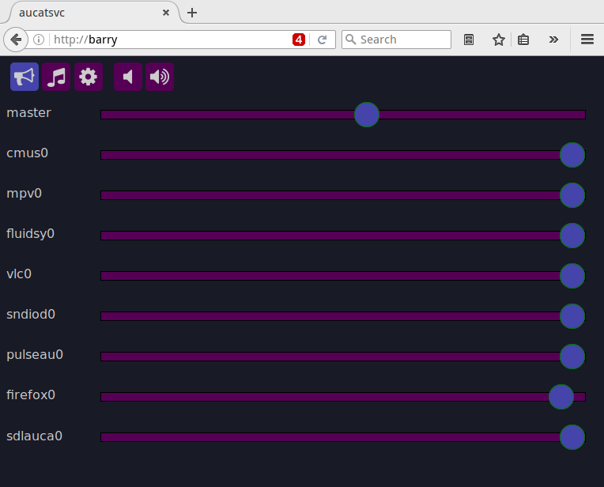
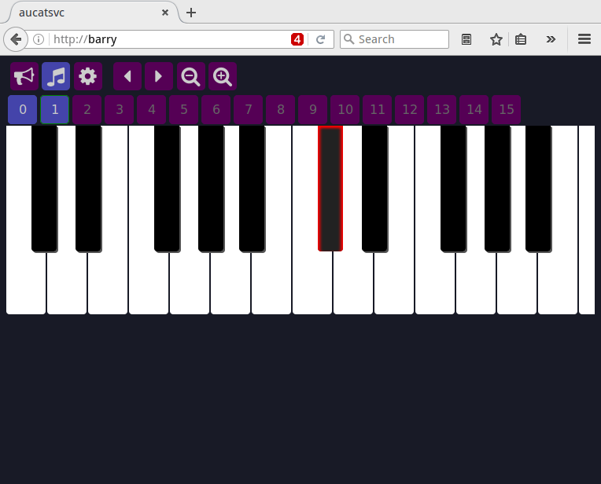
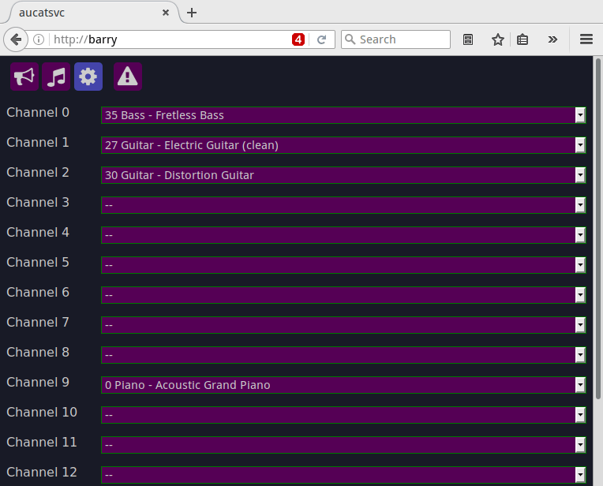

# aucatsvc

Connect this service to your `sndiod` server to:

* Control application volumes
* Send/receive MIDI events to/from e.g. a connected synthesizer to
  * play music,
  * set instruments,
  * or visualize the currently playing notes

## Requirements

Service:
* [Kore](http://www.kore.io/) compiled with tasks and HTTP support
* [Sndio](http://www.sndio.org/)
* [Sassc](https://github.com/sass/sassc)

Client:
* A recent web browser that understands ECMAScript 6.  Firefox has to be
  at least version 50 or greater.
* The MIDI keyboard is best used on a touch-capable device ;-)

## Running

1. Update `build.conf` to set `AUDIODEVICE` and `MIDIDEVICE`
2. Build the service: `make`
3. Copy `conf/aucatsvc.conf` and set `chroot`, `runas`, and `bind`
4. Make sure the sndio cookie is readable in the chroot: `cp ~/.aucat_cookie $chroot`
5. Start the service: `kore -c /path/to/aucatsvc.conf`

## Screenshots

## License

Copyright (c) 2016 Tobias Kortkamp

Distributed under the terms of the ISC license

Components under the MIT license:
* Icons: [encharm/Font-Awesome-SVG-PNG](https://github.com/encharm/Font-Awesome-SVG-PNG)
* `_inputrange.scss`: [darlanrod/input-range-sass](https://github.com/darlanrod/input-range-sass)
* `_piano.scss`: [mrcoles/javascript-piano](https://raw.githubusercontent.com/mrcoles/javascript-piano/master/piano.css)